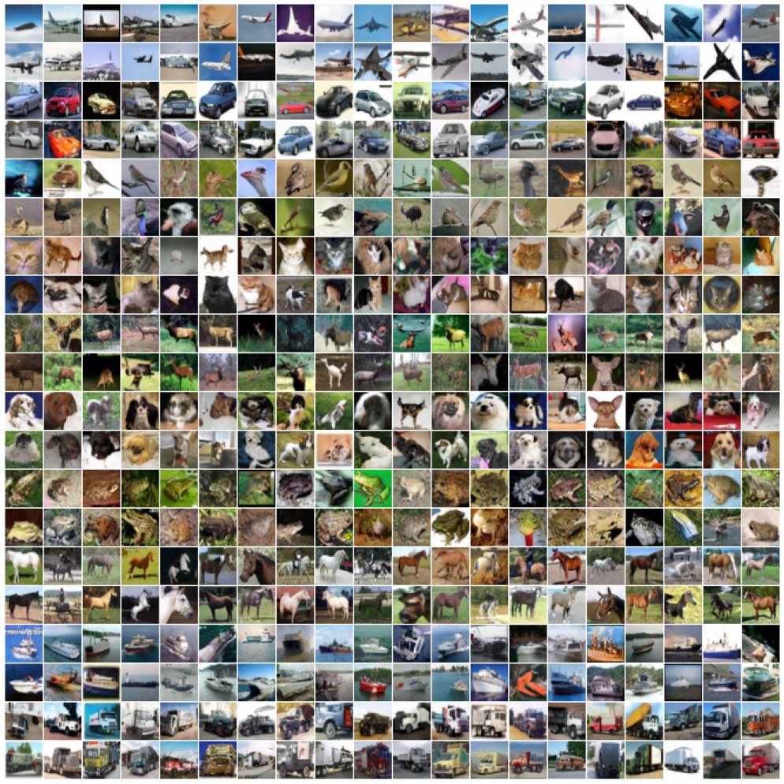

# CIFAR-5m

CIFAR-5m is a dataset of ~6 million synthetic CIFAR-10-like images (RGB 32 x 32px).
This dataset was used in the [Deep Bootstrap paper](https://arxiv.org/abs/2010.08127).

It was generated by sampling the DDPM generative model of [Ho et al.](https://github.com/hojonathanho/diffusion),
which was trained on the CIFAR-10 train set.
The unconditional images were then labeled by a 98.5% accurate [Big-Transfer](https://github.com/google-research/big_transfer) model.
Specifically, we used the pretrained BiT-M-R152x2 model, fine-tuned to CIFAR-10.

## Accessing the Dataset
CIFAR-5m is available publicly on Google Cloud Storage as 6 npz files,
accessible at `gs://gresearch/cifar5m/part{i}.npz` for `i` in `{0,...,5}`.
Or via HTTP, e.g. <https://storage.cloud.google.com/gresearch/cifar5m/part0.npz>.

## Samples

## Benchmarks
The distribution of CIFAR-5m is of course not identical to CIFAR-10,
but is close for research purposes.
The following tables are baselines of training a network on 50K samples of either dataset (CIFAR-5m, CIFAR-10), and testing on both datasets.

ResNet18 trained with standard data-augmentation:

|  Trained On  |   Test Error On  | → |
|------------------|-----------------------------------|-----|
|     ↓        | CIFAR-10                          | CIFAR-5m |
|  CIFAR-10   | 0.050                             | 0.096    |
|  CIFAR-5m   | 0.110                             | 0.106    |

 WideResNet28-10 trained with cutout augmentation:
|  Trained On  |   Test Error On  | → |
|------------------|-----------------------------------|-----|
|     ↓        | CIFAR-10                          | CIFAR-5m |
|  CIFAR-10   |  0.032                              |  0.091     |
|  CIFAR-5m   |  0.088                          |  0.097   |

